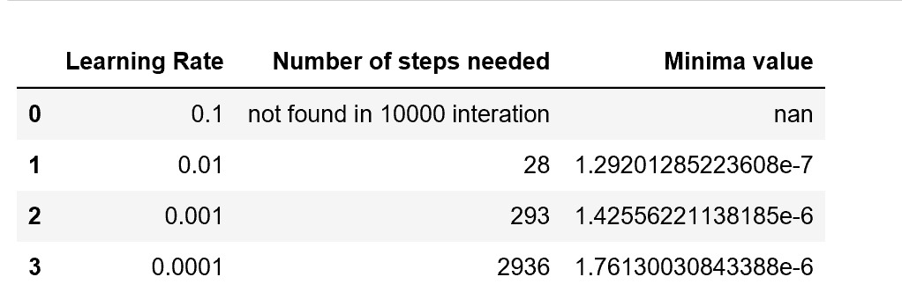
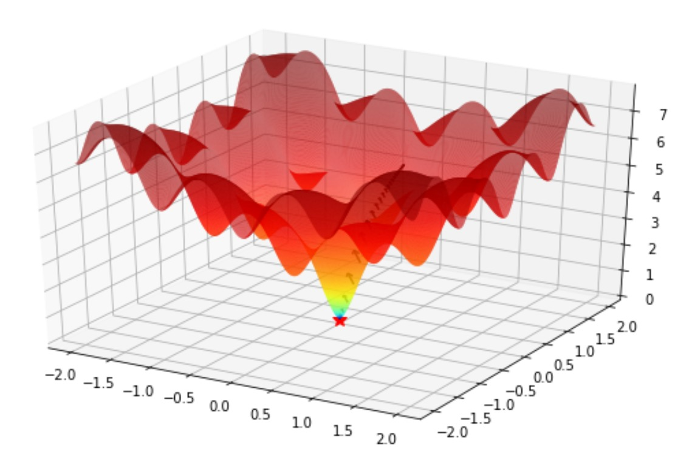
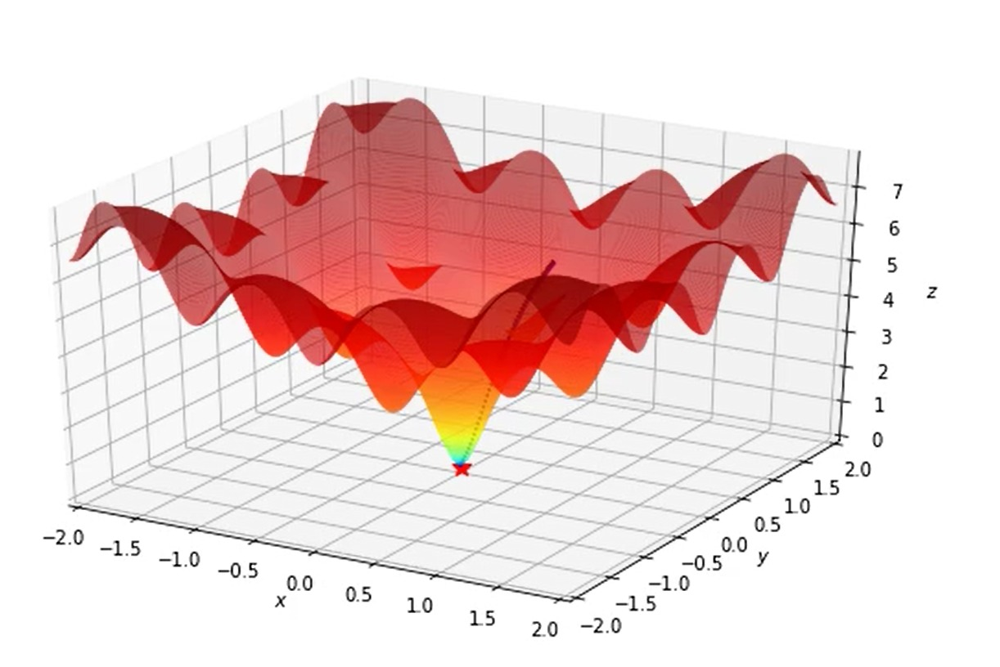

# AML_2019_Group8

## Part 1 

## Why is gradient descent important in machine learning? 

Gradient descent is an optimisation algorithm to minimise functions by moving in direction of defined steepest descent iteratively. In machine learning, we use gradient descent to update parameters of model. It is one of the basic and simple tools to optimise arbitrary objective functions. Using gradient descent can lead to a better control of algorithm as the process of learning parameter, it allows users to control step size. 

## How does plain vanilla gradient descent work? 

A vanilla gradient descent, also known as batch gradient descent, is a usual, standard or unmodified of values. Gradient is computed as the average of gradient of each datapoint. It calculated the error for each observation in the dataset and perform updates after all observation have been evaluated. The flaw of vanilla gradient descent is as it represents a huge consumption of computational resource, entire dataset needs to remain in memory. 

## Two modifications to plain vanilla gradient descent.

Gradient descent of momentum works by replacing current gradient with velocity and to smoothen out update with consideration of past gradient. It computes exponentially weighted average of gradient and to update parameters afterward. It works faster compare to standard gradient descent algorithm.

Adaptive gradient, aka AdaGrad, works on learning rate component through dividing learning rate by the cumulative sum of current and past squared gradients. Different from momentum, AdaGrad computed the route through adaptively scaled the learning rate for each dimension. This algorithm is best used for sparse data as it decreases the learning rate faster for frequent parameters. 

## Investigate the ability of plain vanilla gradient descent to find the global minimum. Experiment with different step sizes. Show graphically or otherwise how the number of steps to convergence varies with step size. Provide graphical output that shows the function and the path followed by gradient descent.

We fixed the starting point as x=0.5, y=0.5, change the different learning rate and set the maximum learning steps as 10000. As the learning rate equal to 0.01 has the lowest minima value, we choose 0.01 as our learning rate.

## Experiment with two variants of gradient descent to see if they improve in any way on the above results. Communicate your results with easy to understand text, tables and graphics (and/or animations).

In order to observe the moving steps clearing, we can only plot the x and y limit from -2 and 2. The first gradient descent (aka the multivariable), as shown below, is always moving at the steepest direction. It takes only 25 steps to find the global minimum (with value: 1.699376 .. e-5). The x and y are 0.0006338 and 0.00045771 respectively. 

 
The second gradient descent that only evaluate the value for the 4 direction(N,E,S,W) as any point of the path. is converging to the minima point slower as it does not always move to the steepest direction directly in one step (but maybe 2/3 steps) It just take 50 steps to find the global minimum (With value: 3.1086244689504383e-15). The x and y are -3.08780779e-1and -3.08780779e-16 separately. 

 
By comparing both covariance of gradient descent (GD), multivariable GD is more accurate and effective to find the best route to the steepest point. It save more time on computing with less steps taken where basic GD used 50 steps and multivariable GD used 25 steps.

